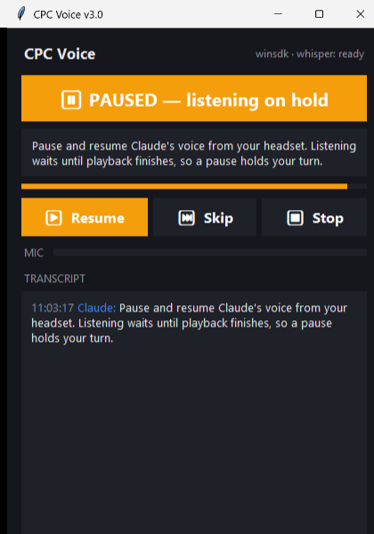

# Voice-Command

[](https://github.com/AIWander/Voice-Command/actions/workflows/ci.yml) [](https://opensource.org/licenses/Apache-2.0) [](https://www.python.org/downloads/)

**Talk to your AI. Hear it work.**

Voice-Command lets you voice-control your AI end-to-end. You say what you want done — Claude chat or another AI does it, using whatever tools, connectors, and MCPs it has access to — and narrates what it's doing as it goes. Voice adds no new privileges; it only invokes tools the user has already installed and enabled. Sensitive actions should require confirmation. If it can do it typed, you can ask for it spoken.

Under the hood it uses [faster-whisper](https://github.com/SYSTRAN/faster-whisper) to understand what you say (running fully on your own computer — your voice doesn't go to the cloud) and [edge-tts](https://github.com/rany2/edge-tts) to speak responses back through Microsoft Edge's online text-to-speech service. It also reads the *feel* of how you say things — excited, hesitant, frustrated — and passes that along so the AI can respond more naturally.

---

## 🔒 What stays local

Voice-Command's microphone capture, speech-to-text, silence detection, noise filtering, emotion detection, and audio playback run on your machine. The listening server binds to `localhost:5123`, not your LAN.

Text-to-speech currently uses `edge-tts`, which calls Microsoft Edge's online TTS service. Your AI may also reach out for its own model calls (Claude pings Anthropic, ChatGPT pings OpenAI, and so on), and tools it calls might reach out too (web search, email connectors). For a fully offline loop, pair this with a local model and replace `edge-tts` with a local TTS backend.

## Safe Use / Permission Model

AIWander tools are local, user-authorized MCP capability surfaces. They do not grant an AI new permissions by themselves. They expose tools the user explicitly installs and enables. Sensitive actions should be confirmed by the user, credentials should stay in the OS keyring or local vault, and demos should use mock data.

---

## 🖥️ Platform support

**Windows is the primary supported platform** (x64 and ARM64), and it now gets the **Voice App** — a single window that handles speech playback *and* listening, with pause/resume from your headset button. See [The Voice App](#the-voice-app-windows) below. **macOS** has an experimental source install path: the Python listener runs with Homebrew `portaudio`, `server.py` uses the built-in `afplay` player for TTS playback, and the Rust `voice-mcp` wrapper builds on both Intel and Apple Silicon — macOS uses the terminal listening server rather than the Voice App for now. For **Linux**, see the upstream [`AIWander/voice`](https://github.com/AIWander/voice) repo — there's a community fork there with Linux support.

---

## Works with

Voice-Command is a STDIO MCP server, so it plugs into any AI client that speaks MCP. That includes:

- **Claude** (chat) — Claude Desktop and the web app
- **Cowork** — Claude's desktop agent
- **Claude Code** — the CLI coding agent
- **Codex CLI** — OpenAI / GPT
- **Gemini CLI** — Google
- **LM Studio** — for running local models (Llama, Qwen, Mistral, whatever you've loaded up)
- **Anything else that can call a STDIO MCP server** — the protocol is the only requirement

It doesn't care which model is on the other end. If your AI of choice can call MCP tools, you can talk to it.

---

## How a turn works

1. **You hear a series of beeps.** That's the AI's "I'm listening, your turn" cue.
2. **You talk.** Say what you want done. Anything your AI has the tools and authorization to handle counts.
3. **The AI works — and tells you out loud what it's doing as it goes.** ("Checking your calendar… found three events tomorrow… drafting the reply…")
4. **You hear the beeps again.** The AI's done with that turn. Your move.

**One thing to know up front:** the audio flow is one-way at a time. You can't cut the AI off mid-sentence with your voice — once it's talking or working, the only way to interrupt is to click or tap directly in the AI's UI. The beeps are the only voice handoff signal.

---

## How to end a session

Just tell the AI you're done — *"I'm done talking,"* *"let's talk later,"* *"bye for now,"* anything in that family. Or hit the stop button in your AI's UI. Both work; saying it out loud is more graceful.

---

## What you can actually ask for

Anything your AI has the tools to do. A few examples to give you the shape of it:

- *"Check my calendar for tomorrow and read me what's on it."* → uses your Google Calendar connector
- *"Search the web for the latest on [topic] and summarize."* → uses web search
- *"Read me the README in this folder."* → uses local filesystem
- *"Find the file we were editing yesterday and fix the bug we talked about."* → uses filesystem + memory of past chats
- *"Draft an email to Sarah saying I'll be ten minutes late and ask me before sending."* → uses your email connector
- *"Run the test script and tell me when it's done."* → uses shell access

The voice layer doesn't add capabilities — it just changes how you reach them. Whatever connectors, MCPs, and tools you've already hooked up to your AI all work the same. You're just using your mouth instead of your keyboard. Treat voice commands the same way you treat typed commands: if your AI has tools that can send email, edit files, run shell commands, or trigger automations, those tools can also be invoked by speech.

---

## Pairs nicely with

Voice-Command is most useful when your AI also has hands. These three companion MCPs are all **local tools** that live on your computer, all callable by voice once Voice-Command is wired up:

- **[`ops`](https://github.com/AIWander/ops)** — file and shell operations: read/write files, run commands, manage processes
- **[`hands`](https://github.com/AIWander/hands)** — browser automation, Windows UI control, vision/OCR
- **[`workflow`](https://github.com/AIWander/workflow)** — API discovery and replay, credential vault, scheduled flows

Install any combination. Voice-Command is the mouth and ears; these are the rest of the body. These tools run locally, but the actions they perform can still touch files, browsers, APIs, email, or shell commands depending on what you have enabled.

---

## The easy way to install: ask your AI to do it

This is the whole point. You shouldn't need a CS degree to get this running.

If you have **Claude Desktop with [`ops`](https://github.com/AIWander/ops) installed**, **Cowork**, **Claude Code**, **Codex CLI**, or **Gemini CLI** open right now, copy this and paste it to your AI:

> `https://github.com/AIWander/Voice-Command` — Can you install this MCP for us to use here, set up the voice listening server, and make me a `.bat` to launch it. Walk me through any restart or step I need to do. **Tell me clearly when everything's installed and we're ready to talk.**

Your AI will:

1. Grab the right `voice-mcp.exe` for your computer (ARM64 or x64) from the [latest release](https://github.com/AIWander/Voice-Command/releases/latest)
2. Drop it somewhere sensible (usually `%LOCALAPPDATA%\CPC\servers\`)
3. Wire it into your AI client's MCP config file — your existing setup is preserved, and a timestamped backup is made first, so nothing breaks
4. Clone this repo and install the Python pieces
5. Write you a `START_VOICE_SERVER.bat` you can double-click whenever you want to talk
6. Walk you through restarting your AI client and starting the listener
7. Tell you when everything's ready

Then you're talking. Literally.

> **After install — starting voice mode is just asking for it.** Once everything's running and you've restarted your AI client, you don't need to paste anything else. On **Claude chat** or **Cowork**, just ask the AI *"let's talk"* or *"start voice mode"* — it'll fire up the listening loop and you'll hear the beeps. Same on other MCP-capable clients.

> **Don't forget the connector toggle.** In Claude Desktop and Cowork, MCP connectors have an on/off switch in **Settings → Connectors**. Make sure the voice MCP entry is toggled **on** after the restart, otherwise the AI won't see the speak/listen tools.

> **No Python on the machine?** Voice-Command's listening server runs on Python 3.11. If you don't have Python installed, your AI can fetch it for you using [`ops`](https://github.com/AIWander/ops) — just ask. Without Python, the AI can still **talk** to you (text-to-speech works), but it can't **hear** you (no listening server). Both halves need Python. On Windows ARM64 you'll specifically want x64 Python 3.11 since some dependencies don't ship ARM64 wheels yet.

> **Don't have an operator MCP yet?** [`ops`](https://github.com/AIWander/ops) is the recommended one — public, lightweight, does file/shell work for any AI you want to give hands to. Install ops first, then come back and paste the prompt above. If you have `local`, `programmer`, or another operator MCP already, those work too.

If your AI doesn't have access to your filesystem and shell, scroll down to **Manual installation** below — or run `install.ps1` yourself in a PowerShell window.

---

## What it looks like when it's running

<!-- TODO: drop screenshot of voice_server.py running into docs/ and update this image link -->

> 📸 *Screenshot of the voice listening server in action — coming soon. Once you've installed Voice-Command, the server window will look something like this, with a beep cue when it's your turn and a live RMS readout while you talk.*

---

## What you'll need on your computer

- **Windows 10 or 11**, or macOS for the experimental source install path
- **Python 3.11 or newer** — [download here](https://www.python.org/downloads/)
- **A microphone** — built-in or USB, doesn't need to be fancy
- **PortAudio** — a library that lets Python use your mic; usually installs automatically on Windows, and should be installed with Homebrew on macOS
- **ffmpeg** — for playing back the AI's voice; free, [grab it here](https://ffmpeg.org/download.html)

If any of those words look scary, don't worry — your AI can handle all of this for you using the prompt at the top.

---

## Installer script (`install.ps1`)

If your AI can run scripts but isn't great at multi-step shell flows, point it at `install.ps1`:

```powershell
.\install.ps1
```

What it does, in order:

1. Detects your CPU architecture (ARM64 or x64) and downloads the matching `voice-mcp.exe` from the latest release to `%LOCALAPPDATA%\CPC\servers\` (override with `-InstallDir`).
2. Installs Python listening-server dependencies with `pip install -r requirements.txt` (skip with `-SkipPython` if you only want to *talk*, not *listen*).
3. Detects which MCP clients you have installed (Claude Code, Claude Desktop, Codex Windows, Gemini CLI, LM Studio) and adds a `voice` entry to each — backed up first.
4. For Codex (TOML), prints the snippet to append manually — PowerShell can't round-trip TOML safely.
5. Ends with a clear "say hi out loud and then listen for me" check so you know the round-trip works.

Useful flags:

- `-Verify` — report state only, change nothing
- `-DryRun` — print what *would* happen
- `-SkipPython` — binary + configs only
- `-InstallDir <path>` — install the binary somewhere other than `%LOCALAPPDATA%\CPC\servers`

---

## Manual installation (if you'd rather drive yourself)

Clone the repo, then:

```bash
pip install -r requirements.txt
```

On macOS, install the native audio prerequisites first:

```bash
brew install python@3.11 portaudio ffmpeg
python3.11 -m venv .venv
source .venv/bin/activate
python -m pip install -U pip
python -m pip install -r requirements.txt
```

### PortAudio

`pip install pyaudio` usually just works on Windows. If it complains, grab a wheel from [the unofficial PyAudio wheels page](https://www.lfd.uci.edu/~gohlke/pythonlibs/#pyaudio).

On macOS, install Homebrew `portaudio` before installing Python dependencies:

```bash
brew install portaudio
```

### ffmpeg

`winget install Gyan.FFmpeg`, or download from [ffmpeg.org](https://ffmpeg.org/download.html). Make sure it's on your PATH, or set the `VOICE_FFMPEG_PATH` environment variable to point at it.

On macOS, `brew install ffmpeg` is enough for the listener stack. The Python MCP fallback uses macOS `afplay` directly for generated MP3 speech, so it does not need `simpleaudio` for playback there.

> Setting up on Linux? The upstream [`AIWander/voice`](https://github.com/AIWander/voice) repo has a Linux fork with the equivalent install steps.

---

## Running it

Start the voice server:

```bash
python voice_server.py
```

It runs at `http://localhost:5123`. On Windows, you can also just double-click `START_VOICE_SERVER.bat`. On macOS, run:

```bash
./START_VOICE_SERVER.sh
```

You mostly won't touch the endpoints directly — the AI calls them for you — but here they are:

| Endpoint | What it does |
|---|---|
| `GET /status` | Health check |
| `POST /listen?timeout=30` | Records, transcribes, reads emotion |

Optional knobs you can pass to `/listen`:

- `skip_emotion=true` — don't bother with emotion detection
- `skip_filter=true` — turn off noise filtering
- `silence_timeout=4.0` — how long of a pause before it stops listening
- `min_speech_duration=3.0` — how long you need to talk before it'll consider stopping
- `rms_threshold=100` — how loud counts as "talking" (20–500)

---

## The Voice App (Windows)

The terminal listener works, but on Windows there's a nicer way: **the Voice App**. One small window replaces the terminal entirely and handles both halves of the conversation:

<p align="center">
  
</p>

> 📖 **Driving it from an AI agent?** See the [Voice System operating guide](docs/VOICE_SYSTEM.md) — the pause/interrupt/stop control model, the HTTP API on `:5123`, the playback backends, and the rules for running a clean voice exchange.

```
START_VOICE_APP.bat
```

What you get:

- **Pause the AI's voice with your headset button.** The app registers as a real Windows media session, so the play/pause button on your earbuds, headset, or keyboard pauses and resumes Claude's voice exactly like it would Spotify. There's a pause button in the window too (it turns amber while paused), and spacebar works.
- **Pausing also pauses the conversation.** The switch back to listening is triggered by the *end of playback*, not the end of the AI's response — so while you have the voice paused, the mic stays off and the ready-beep waits. Unpause, let it finish, and listening starts on its own.
- **The AI keeps working while you listen.** Speech is queued and played in the background, so the AI can keep using tools — or even finish its whole response — while you're still hearing it.
- **Status at a glance**: speaking / paused / listening state, playback progress, live mic level, and a color-coded transcript of the conversation.

It works on both **x64 and ARM64** Windows (on ARM64, build the `.venv` from x64 Python 3.11 — same note as the listener, `ctranslate2` doesn't ship ARM64 wheels). Native media-session support uses the `winsdk` package; if it isn't available the app falls back to an equivalent player with a media-key hook, and everything still works.

The app serves the same `http://localhost:5123` API as the terminal listener (so the MCP wrapper auto-detects it), plus playback endpoints: `POST /say`, `/pause`, `/resume`, `/toggle`, `/skip`, `/stop`, and `GET /playback`.

On macOS, stick with `./START_VOICE_SERVER.sh` — the Voice App's media-session integration is Windows-only for now.

---

## Running headless on Windows

If you don't want a console window sitting on screen, swap `python.exe` for `pythonw.exe` (the windowless Python host) and launch via PowerShell's hidden window flag:

```powershell
Start-Process -FilePath "C:\Python311-x64\pythonw.exe" `
              -ArgumentList '"C:\path\to\Voice-Command\voice_server.py"' `
              -WorkingDirectory "C:\path\to\Voice-Command" `
              -WindowStyle Hidden
```

The server still listens on `localhost:5123` and reads `voice.config.toml` from its working directory — there's just no console to see or close. Cold start is ~6 seconds while the speech model loads, then it's idle until `/listen` is called.

Resource cost at idle: ~250 MB RAM, zero CPU.

To persist across reboots, drop a shortcut to that PowerShell line in `shell:startup`, or register a Scheduled Task at user logon (action: `pythonw.exe`, args: `"path\to\voice_server.py"`, run hidden as user).

To stop it: `Stop-Process -Name pythonw -Force` (caution: kills *all* pythonw — narrow by PID if you have other Python tools running).

---

## Tweaking the defaults

Drop a file called `voice.config.toml` next to the script (or set `VOICE_CONFIG_PATH` to point at it). A `voice.config.example.toml` is included in this repo — copy it and edit. Tuned defaults for natural back-and-forth conversation:

```toml
[listen]
silence_timeout_secs = 3.0
min_speech_duration_secs = 2.0
rms_threshold = 100
noise_filter_enabled = true
pre_record_enabled = true
```

> Earlier defaults of 4.0/3.0 felt sluggish in conversational use. For typing-replacement / dictating long prose, raise `silence_timeout_secs` to 5.0+ so natural pauses don't cut you off.

It looks for config in this order:

1. `VOICE_CONFIG_PATH` environment variable
2. `./voice.config.toml` (current directory)
3. `~/.config/voice/voice.config.toml`

---

## How an MCP client connects to it

`server.py` is a thin wrapper that exposes three tools to any MCP client:

- `speak` — say something out loud
- `listen_for_speech` — listen for what the user says (waits for any paused/playing speech to finish first)
- `playback_control` — pause, resume, skip, or stop the voice playback (Voice App only)
- `start_voice_mode` — kick off a back-and-forth conversation

For everyday use, there's a Rust version of that wrapper (`voice-mcp.exe` on Windows, `voice-mcp` on macOS) that's faster and more stable. Windows builds come as release downloads (ARM64 + x64), and the release workflow is set up to publish macOS Intel + Apple Silicon builds on future tags. The Python `server.py` works as a fallback if you'd rather not use the binary.

### Config snippets per client

Copy the snippet for your AI client into the file path shown. `install.ps1` does the wiring for you on JSON clients — these snippets are the fallback if it can't reach the file (or if you'd rather edit by hand). The snippets below use `C:\Users\YOUR-USER\AppData\Local\CPC\servers\voice-mcp.exe`; replace `YOUR-USER` with your Windows username, or use the exact path printed by `install.ps1`. On macOS, point the command to your built or downloaded `voice-mcp` binary, for example `/usr/local/bin/voice-mcp`.

#### Claude Code — `%USERPROFILE%\.claude\mcp.json`

```json
{
  "mcpServers": {
    "voice": {
      "command": "C:\\Users\\YOUR-USER\\AppData\\Local\\CPC\\servers\\voice-mcp.exe"
    }
  }
}
```

#### Claude Desktop — `%APPDATA%\Claude\claude_desktop_config.json`

```json
{
  "mcpServers": {
    "voice": {
      "command": "C:\\Users\\YOUR-USER\\AppData\\Local\\CPC\\servers\\voice-mcp.exe"
    }
  }
}
```

#### Codex (Windows app) — `%USERPROFILE%\.codex\config.toml`

```toml
[mcp_servers.voice]
command = "C:\\Users\\YOUR-USER\\AppData\\Local\\CPC\\servers\\voice-mcp.exe"
cwd = "C:\\Users\\YOUR-USER\\AppData\\Local\\CPC\\servers"
```

> `install.ps1` doesn't auto-edit this one — TOML round-tripping in PowerShell is fragile. Append the block manually; it's two lines.

#### Gemini CLI — `%USERPROFILE%\.gemini\settings.json`

```json
{
  "mcpServers": {
    "voice": {
      "command": "C:\\Users\\YOUR-USER\\AppData\\Local\\CPC\\servers\\voice-mcp.exe"
    }
  }
}
```

(Add to the existing `mcpServers` object alongside your other entries — don't replace the whole file.)

#### LM Studio — `%USERPROFILE%\.lmstudio\mcp.json`

```json
{
  "mcpServers": {
    "voice": {
      "command": "C:\\Users\\YOUR-USER\\AppData\\Local\\CPC\\servers\\voice-mcp.exe"
    }
  }
}
```

> **Other MCP-speaking clients work too.** If your AI's client isn't above but accepts STDIO MCP servers, use whichever JSON snippet matches — the three lines that matter are `"voice"`, `"command"`, and the absolute path to `voice-mcp.exe`.

### Reloading your client (usually not required)

Most MCP clients pick up new STDIO servers on the next tool-list refresh — no full restart. If your client doesn't see the `voice`, `listen_for_speech`, or `speak` tools after a minute, then restart it. Claude Desktop and Codex Windows app sometimes need a full quit-and-reopen on first wire-up.

### Verify by saying hi

Skip the formal health check — just use the tools themselves. Ask your AI:

> *"Say hi out loud and then listen for me."*

If you hear the AI greet you and then hear the listening **beep**, you're wired up end-to-end. Talk back and confirm it transcribed you. If something's broken, you'll know exactly which half failed:

- No voice → TTS half is off (likely ffmpeg missing or audio output device wrong)
- Voice but no beep → MCP wiring worked for speak, not for listen (config has the entry but maybe server.py isn't running)
- Beep but no transcription → microphone permission off (see the warning earlier) OR `voice_server.py` not running OR mic not picked up
- Full round-trip works → you're done. Talk away.

---

## Building `voice-mcp` from source

The Rust source for `voice-mcp.exe` lives in [`voice-mcp/`](voice-mcp/) at the root of this repo. To build it yourself instead of grabbing the prebuilt binary from releases:

```sh
cd voice-mcp
cargo build --release
```

The compiled binary lands in `voice-mcp/target/release/voice-mcp.exe` on Windows and `voice-mcp/target/release/voice-mcp` on macOS. Move it wherever you like and point `claude_desktop_config.json` at it.

You'll need a [Rust toolchain](https://rustup.rs/) installed. Building takes a couple of minutes on a modern machine. The release workflow on tag push builds ARM64 and x64 binaries for Windows and macOS automatically.

---

## What's in the box

- `voice_server.py` — the standalone HTTP server that does the actual listening, transcribing, and tone-reading
- `server.py` — the MCP wrapper your AI client talks to; calls `voice_server.py` for input and edge-tts for output
- `response_analyzer.py` — separate analyzer that reads emotion from text the AI says back
- `emotion_config.json` — knobs for the response analyzer (which words count as excited, hedging, etc.)
- `play_audio.ps1` — Windows audio playback helper
- `START_VOICE_SERVER.bat` — Windows launcher

---

## Environment variables

| Variable | What it's for | Default |
|---|---|---|
| `VOICE_CONFIG_PATH` | Where your `voice.config.toml` lives | Auto-discovered |
| `VOICE_FFMPEG_PATH` | Where ffmpeg lives | Found via PATH |
| `VOICE_EMOTION_LOG_DIR` | Where emotion logs get written | `~/.voice/logs/` |
| `VOICE_TRANSCRIPT_LOG_PATH` | Rolling transcript log path for voice checkpoints | `%LOCALAPPDATA%\Voice-Command\voice_sessions\rolling_log.jsonl` |

---

## Troubleshooting

**`pip install pyaudio` fails on Windows ARM64.**
PyAudio doesn't ship native ARM64 wheels yet. Install x64 Python 3.11 alongside your ARM64 Python (Windows 11 ARM64 runs x64 Python under emulation just fine), and use the x64 interpreter to run `voice_server.py`. Or grab a precompiled ARM64 wheel from the [unofficial PyAudio wheels page](https://www.lfd.uci.edu/~gohlke/pythonlibs/#pyaudio).

**ffmpeg not found.**
Either add ffmpeg to your `PATH` or set the `VOICE_FFMPEG_PATH` environment variable to the full path of `ffmpeg.exe`. On Windows, `winget install Gyan.FFmpeg` is the easiest install.

**Python 3.13 wheel mismatch.**
`faster-whisper` and `pyaudio` don't have Python 3.13 wheels yet at the time of writing. Stick with Python 3.11 or 3.12 until the dependency tree catches up.

**Microphone permission denied.**
Check Windows Settings → Privacy & security → Microphone, and make sure both "Microphone access" and "Let apps access your microphone" are on. If you launched `voice_server.py` from a terminal, that terminal needs mic permission too.

**MCP connector toggle is off.**
In Claude Desktop, Settings → Connectors → make sure the `voice` (Rust) or `voice-command` (Python) toggle is ON. If neither is on, your AI won't see the tools.

**`voice-command` MCP can't reach the listener.**
The MCP wrappers (`voice-mcp.exe` or `server.py`) talk to `voice_server.py` over `localhost:5123`. Make sure the listening server window is open and showing output. Restart `START_VOICE_SERVER.bat` if it's quiet.

**Whisper model download stalls on first run.**
The first time `voice_server.py` starts, faster-whisper downloads the Whisper model (~150 MB for the base model). This can stall on slow connections. Run `voice_server.py` once at install time and let the download finish before trying voice mode in your AI client.

---

## License

Apache 2.0 — see [LICENSE](LICENSE).
